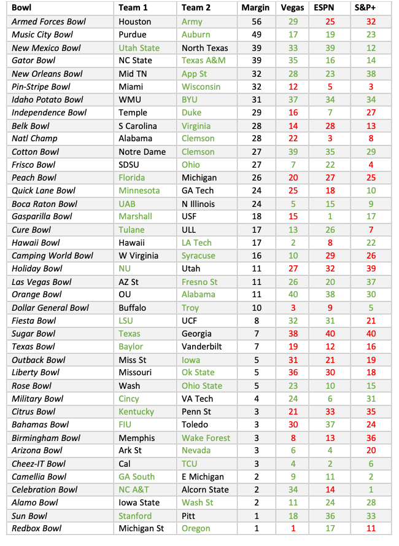
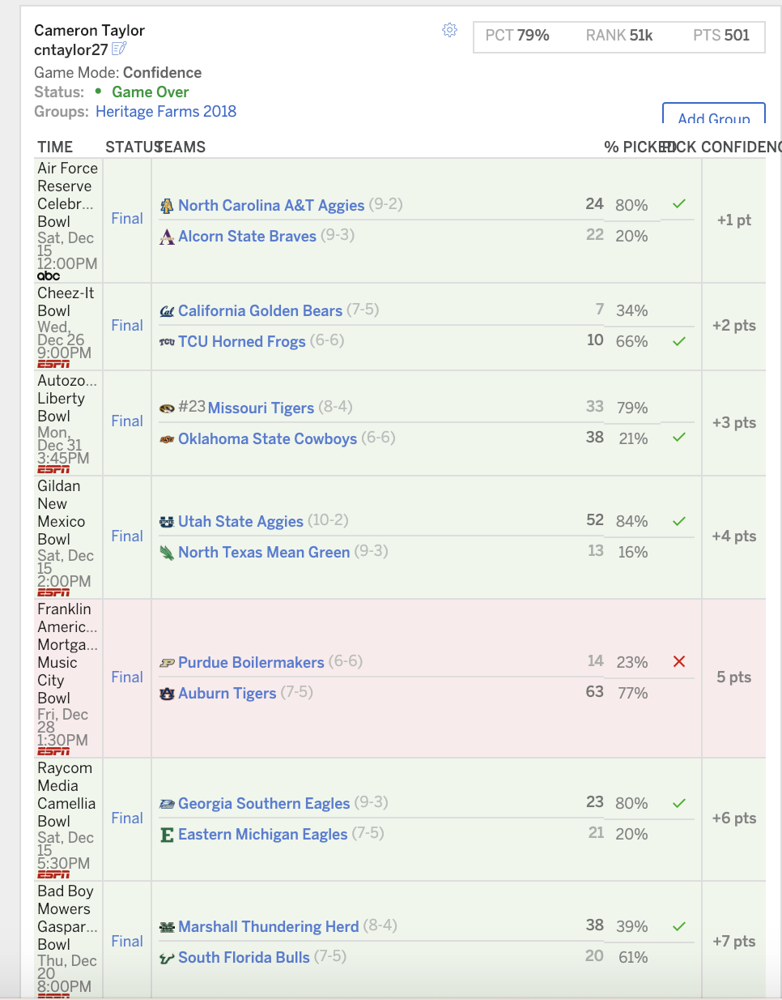
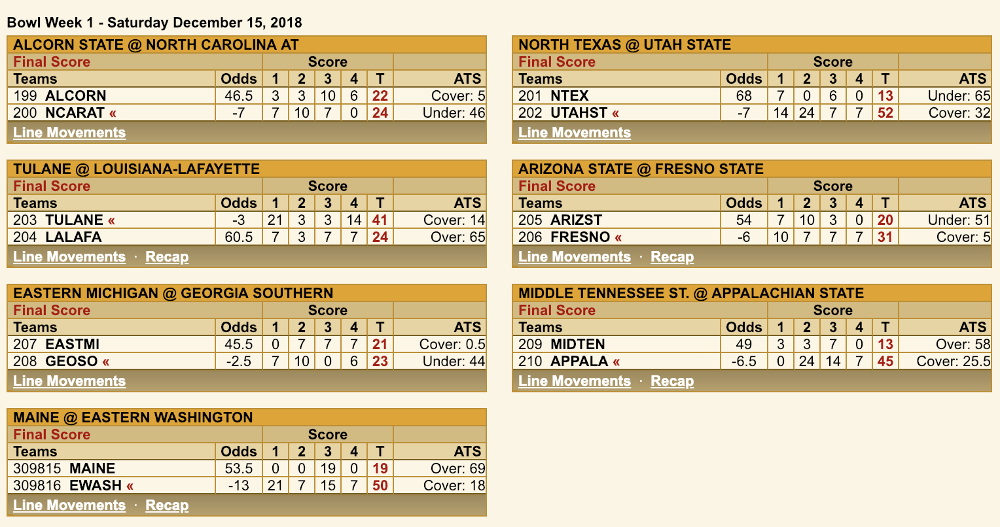
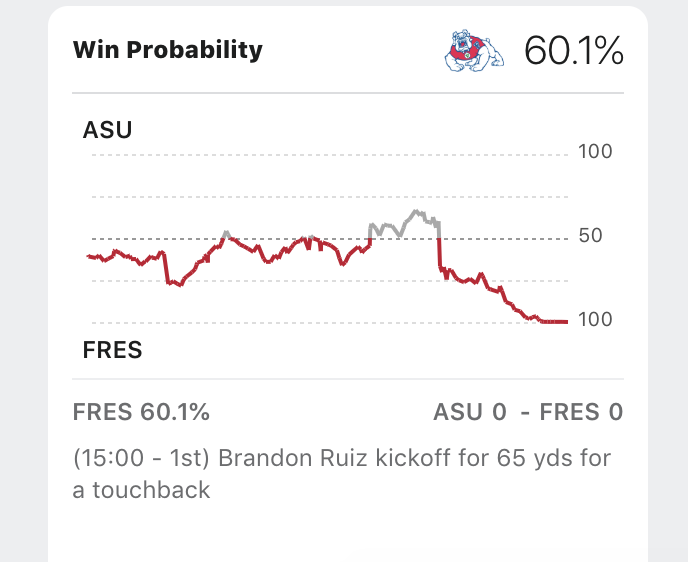
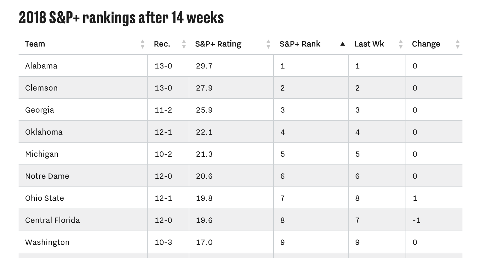

[Blog](https://cameronntaylor.github.io/blog/) | [My Personal Website](https://cameronntaylor.github.io/)

Every year college football fans agonize over their bowl picks in [ESPN's College Football Bowl Mania](http://fantasy.espn.com/college-bowl-mania/2018/en/). This contest gives fans the chance to pick the winner _and_ assign confidence points to all of the 40 or so college football bowl games. Fans hone their predictions skills for college football in a very uncertain environment over a short period of time.

It is not hard to see why college football bowl games are tricky to pick. Some of these reasons include:

- Geographic Factors and Attendance: Bowls take place all over the country and teams rarely have true &quot;home games&quot;. This affects attendance (which affects game environment and noise) and weather. Attendance at bowl games can be [quite low](https://www.newsday.com/sports/college/college-football/college-football-bowl-game-attendance-2018-18-1.24180893).  For example, in the Frisco Bowl this year, attendance was 11,000. San Diego State had an average attendance of around 30,000 at all their games. Teams may also be affected by the weather. In the Pinstripe Bowl, Miami played in about 40F weather. In Miami at the time it was _75F_.

- Conference and Schedules: Teams play the majority of their games within their conference. Bowls are, by rule, always outside of conferences. Thus, teams do not have many &quot;common opponents&quot; – teams they have both played - that give a better sense of how the teams might fare against each other.

- Depth Charts: [Key players sit out](https://sports.yahoo.com/college-football-players-sitting-bowl-games-2018-210123415.html). And it's generally hard to measure exactly how important any one player is to a team's success or victory.

There are some obvious ways to make picks: pick the team you like, teams in the conferences you know or support, or just use your pure gut intuition.

One relatively simple way is to use the vast set of sports writers and sports sites that make predictions. Fans can easily free-ride off of the (mostly) publicly available analysis through their favorite sports sites or using other betting market odds.

But one thing fans probably don&#39;t know is what happens when they follow these types of rules. How well do these methods perform? Do they differentiate themselves? In particular, does the average college football fan on Bowl Mania know better than these methods?

To answer this question we look at 3 easy and popular ways to get odds on a particular game: Vegas, ESPN and SBNation&#39;s S&amp;P+.  The goal is to simulate how a fan would do following the recommendations of these platforms.

To do this we need to specify the picks that each platform makes _and_ assign confidence to those picks. Here is how we simulate the picks and confidence points. Supplementary Figures are given at the end of the article.

1. Vegas: For the pick, pick the Vegas favorite. Confidence is assigned by points favorites. So, for example, Alabama was a 14-point favorite over OU and so this received a confidence score of 40. Michigan State was a 1-point favorite over Oregon and so this received a confidence score of 1. All other games had favorites between 1-14 points.
2. ESPN: Before every game, in the game preview ESPN gives each team a percentage chance of winning. For measuring the value of the ESPN method first pick a team if they have at least a 50.01% of winning (ESPN only gives up to 0.01%) and then rank them by most confident by percentage. So, for example, Georgia had a 76.5% chance of winning over Texas, which is the most confident. Marshall had a 50.4% chance of winning over USF, which is the least confident.
3. S&amp;P+: This method selects the team with the higher S&amp;P+ score and then ranks confidence by the difference in their S&amp;P+ scores. ([S](https://www.sbnation.com/college-football/2018/12/2/18122019/ncaa-football-rankings-2018-college-football-playoff)[&amp;P+ scores taken as of December 2, 2018.)](https://www.sbnation.com/college-football/2018/12/2/18122019/ncaa-football-rankings-2018-college-football-playoff) For example, Georgia had an S&amp;P+ rating of 25.9 and Texas had an S&amp;P+ rating of 7.6 giving a difference of 18.3, and the highest confidence pick. Georgia Southern had an S&amp;P+ rating of 2.9 and Eastern Michigan had an S&amp;P+ rating of 2.0 making it the least confident (other than Alcorn State and North Carolina A&amp;T, see notes below).1

In general, we take these simulations to be an &quot;upper bound&quot; of how well one could do following these methods. Read the Appendix and footnotes for more on this at the bottom.

See Table 1 for a breakdown of each methods performance. Below we summarize what we think of as the most interesting takeaways:

1. Ranking: Vegas > ESPN > S&amp;P+ (more on this below).

1. Lopsided games: Vegas correctly predicted the 5 most lopsided games. And they were generally high confidence (average 28.4). ESPN and S&amp;P+ got 4/5 of them

1. Most and least confident: Vegas got 3/5 of their 5 most confident picks. ESPN got 4/5 of their most confident picks. S&amp;P+ got 2/5. Vegas got 2/5 of their 5 least confident picks. ESPN: 2/5. S&amp;P+: 3/5.

1. Biggest mistakes and surprise: Texas beating Georgia was clearly a huge upset – it was in the top 3 most confident picks _for all_ 3 prediction sources. Two other games that stand out as the biggest mistakes are Florida vs. Michigan and S. Carolina vs. Virginia. All methods picked wrong, and the team they picked was crushed. They also had pretty high confidences in each prediction method.

1. Other surprises: There were 9 games that all prediction methods got wrong. This means that if you had taken the optimal combination of all the prediction methods, then the max percentage you could have gotten was just above 75%. This means that _all_ these prediction methods were clearly missing something; they likely misinterpreted similar data.

1. Smallest surprise: BYU beating Western Michigan and Alabama beating OU. Both predictions were average confidences of 35 and 36 across prediction methods and were in the top 10 most confident for each prediction method. They also had margins of 31 and 11 respectively. Clemson beating Notre Dame was not too far behind (average 34).

TABLE 1

 Table 1 Key: Green indicates winning team and correct pick. Red indicates incorrect pick. Number values in method columns are assigned confidence points.

<!--- | Bowl | Team 1 | Team 2 | Margin | Vegas | ESPN | S&amp;P+ |
| --- | --- | --- | --- | --- | --- | --- |
| _Armed Forces Bowl_ | Houston | Army | 56 | 29 | 25 | 32 |
| _Music City Bowl_ | Purdue | Auburn | 49 | 17 | 19 | 23 |
| _New Mexico Bowl_ | Utah State | North Texas | 39 | 33 | 39 | 12 |
| _Gator Bowl_ | NC State | Texas A&amp;M | 39 | 35 | 16 | 14 |
| _New Orleans Bowl_ | Mid TN | App St | 32 | 28 | 23 | 38 |
| _Pin-Stripe Bowl_ | Miami | Wisconsin | 32 | 12 | 5 | 3 |
| _Idaho Potato Bowl_ | WMU | BYU | 31 | 37 | 34 | 34 |
| _Independence Bowl_ | Temple | Duke | 29 | 16 | 7 | 27 |
| _Belk Bowl_ | S Carolina | Virginia | 28 | 14 | 28 | 13 |
| _Natl Champ_ | Alabama | Clemson | 28 | 22 | 3 | 8 |
| _Cotton Bowl_ | Notre Dame | Clemson | 27 | 39 | 35 | 29 |
| _Frisco Bowl_ | SDSU | Ohio | 27 | 7 | 22 | 4 |
| _Peach Bowl_ | Florida | Michigan | 26 | 20 | 27 | 25 |
| _Quick Lane Bowl_ | Minnesota | GA Tech | 24 | 25 | 18 | 10 |
| _Boca Raton Bowl_ | UAB | N Illinois | 24 | 5 | 15 | 9 |
| _Gasparilla Bowl_ | Marshall | USF | 18 | 15 | 1 | 17 |
| _Cure Bowl_ | Tulane | ULL | 17 | 13 | 26 | 7 |
| _Hawaii Bowl_ | Hawaii | LA Tech | 17 | 2 | 8 | 22 |
| _Camping World Bowl_ | W Virginia | Syracuse | 16 | 10 | 29 | 26 |
| _Holiday Bowl_ | NU | Utah | 11 | 27 | 32 | 39 |
| _Las Vegas Bowl_ | AZ St | Fresno St | 11 | 26 | 20 | 37 |
| _Orange Bowl_ | OU | Alabama | 11 | 40 | 38 | 30 |
| _Dollar General Bowl_ | Buffalo | Troy | 10 | 3 | 9 | 5 |
| _Fiesta Bowl_ | LSU | UCF | 8 | 32 | 31 | 21 |
| _Sugar Bowl_ | Texas | Georgia | 7 | 38 | 40 | 40 |
| _Texas Bowl_ | Baylor | Vanderbilt | 7 | 19 | 12 | 16 |
| _Outback Bowl_ | Miss St | Iowa | 5 | 31 | 21 | 19 |
| _Liberty Bowl_ | Missouri | Ok State | 5 | 36 | 30 | 18 |
| _Rose Bowl_ | Wash | Ohio State | 5 | 23 | 10 | 15 |
| _Military Bowl_ | Cincy | VA Tech | 4 | 24 | 6 | 31 |
| _Citrus Bowl_ | Kentucky | Penn St | 3 | 21 | 33 | 35 |
| _Bahamas Bowl_ | FIU | Toledo | 3 | 30 | 37 | 24 |
| _Birmingham Bowl_ | Memphis | Wake Forest | 3 | 8 | 13 | 36 |
| _Arizona Bowl_ | Ark St | Nevada | 3 | 6 | 4 | 20 |
| _Cheez-IT Bowl_ | Cal | TCU | 3 | 4 | 2 | 6 |
| _Camellia Bowl_ | GA South | E Michigan | 2 | 9 | 11 | 2 |
| _Celebration Bowl_ | NC A&amp;T | Alcorn State | 2 | 34 | 14 | 1 |
| _Alamo Bowl_ | Iowa State | Wash St | 2 | 11 | 24 | 28 |
| _Sun Bowl_ | Stanford | Pitt | 1 | 18 | 36 | 33 |
| _Redbox Bowl_ | Michigan St | Oregon | 1 | 1 | 17 | 11 | --->

The overall scores tell a pretty remarkable story. Table 2 gives the overall scores and the percentile results from following these methods. The number 1 reported entry in ESPN received 718 total points. 482 points is good enough for about 68th percentile among all Bowl Mania players; 473 points is about 63rd percentile; and 396 points is about 25th percentile. Thus, it seems that Vegas and ESPN do quite good and do better than the average entry. Vegas gets the slight edge over ESPN, but it was close. For example. If Alcorn State had ended up beating NC A&amp;T (loss by 2 points!) then ESPN would have outperformed Vegas by almost 40 points.

TABLE 2

| **Method** | **Score in 2018-2019** | **Percentile in 2018-2019** |
| --- | --- | --- |
| Vegas | 482 | 68th|
| ESPN | 473 | 63rd|
| S&amp;P+ | 396 | 25th|

So, what do we take away from these point totals and the fact that these are reasonably feasibly methods of picking for Bowl Mania? The biggest takeaway is that the average person would have been better off utilizing Vegas or ESPN than their own picking method!

Does this mean that people are overconfident or making major mistakes? Not necessarily – they may just be having a good time and not caring about their picks, particularly in situations where financial stakes are low. Another potential reason is that the optimal strategy in making these picks depends on the objective function: it is hard to imagine that with the availability of these &quot;open source predictions&quot; one would be able to win Bowl Mania by following Vegas. The reason is quite simple: the decisions and data processed by all of these methods is correlated with many other people&#39;s decision-making processes. This correlation will make your profile of picks look very similar to others, and then you are susceptible to losing out to others who deviate from such profiles with better insider information or who are paying attention more right before the game to take into account injuries or other scouting report news.

While it might make sense to go with Vegas or ESPN if you are aiming to maximize the percentile you finish, you might be better off starting out with something like the Vegas strategy and deviating slightly, particularly if you have insider information, or even randomly to maximize your chance of winning the whole thing.

 Some final methodological notes: Note that these &quot;picking methods&quot; should be seen as an upper-bound on how well you could have done by using these methods. This is because the Vegas and ESPN methods are updated up to the beginning of the game. Since there is a confidence point assignment, one might not properly pick confidence dynamically. The picking methodology used assumes that everyone knows the realized confidences from Vegas and ESPN that are presented. Also, I could not find S&amp;P+ for Alcorn State and North Carolina so I assigned confidence 1 to this pick and gave it to S&amp;P+. I also needed to break ties since my method for Vegas had quite a few ties (multiple games had teams favored by 6.5 points, etc. for the spread). I break ties _in favor_ of the methods (i.e. give them the most points) to give a true upper bound. 

Footnotes:

1:To be fair to the S&amp;P+ rating method, this is not what is suggested for bowl picks nor is it suggested as any means of predicting games. It is our interpretation of the S&amp;P+ method. However, these predictions align almost exactly with the S&amp;P+ spread picks (link to page has been removed), which is more coarse and so the method we use essentially acts as a reasonable tie-breaker for using the spread picks. However, no pick was given for the national championship, and for this we use the S&amp;P+ rating method.

Supplementary Figures:

